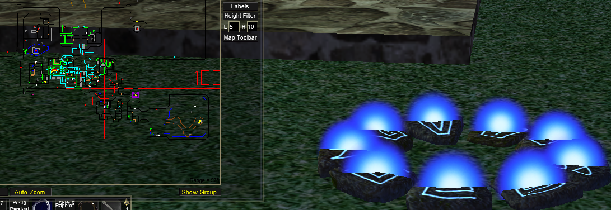

Tearel in the bazaar can be used to teleport to various destinations. You unlock them account wide by visiting certain areas within each zone.

- Using Echo of Memory x5 (Alt Currency) will unlock the ability to teleport your group (and raid) to all locations and to your current expedition. Echo of Memory is currently a Donation Only Item.

> [!note]
> Starting Cities are currently unlocked by default.

The list of locations Tearel can teleport to are:

## Unlocked At Creation


North East corner of the zone.



### Classic

 near zoneline to Arena
 
 

Across the waterfall from QHills zoneline.
 
 

## Castle Mistmoore (mistmoore) (Discoverable)
 near the Lesser Faydark zone out.
 

## Cazic Thule (cazicthule)
Suspected Removed.


## Dagnor's Cauldron (cauldron) (Discoverable)
 near the Unrest zone in.
 

## Erud's Crossing (erudsxing)
Suspected Removed.


## Erudin (erudnext)
Starting Portal


## Everfrost (everfrost) (Discoverable)
 not too far up the tunnel heading north from permafrost.
 

## Felwithe (felwithea)
Starting Portal


## Greater Faydark (gfaydark)
Starting Portal


## Grobb (grobb)
Starting Portal


## Halas (halas)
Starting Portal


## High Keep (highkeep) (Discoverable)
 courtyard upon entering zone.
 

## Hole (hole) (Discoverable)
 near the drop cliff near entrance.
 

## Kaladim (kaladima)
Starting Portal


## Lavastorm (lavastorm) (Discoverable)
 at the druid ring.
 

## Nagafen's Lair (soldungb)
Suspected Removed.


## Neriak Commons (neriakb)
near Neriak Foreign Quarter exit


## North Karana (northkarana) (Discoverable)
 at gypsy camp.
 

Near pool to qeynos catacombs



## Oasis of Marr (oasis) (Discoverable)
 near the gypsy merchant.
 

## Ocean of Tears (oot) (Discoverable)


## Oggok (oggok)
Starting Portal


## Paineel (paineel)
Near zone in by Toxxula Forest


## Plane of Hate (hateplaneb)
Default unlocked upon reaching 46.


## Rathe Mountains (rathemtn)
near arena


## Rivervale (rivervale)
Starting Portal.


## South Karana (southkarana) (Discoverable)
 at aviak treehouse
 

## Surefall Glade (qrg) (Discoverable)
 next to the building in the pond
 

## West Commonlands (commons)



## West Freeport (freportw)
Starting Portal


### Kunark


 outside of Chardok, NW corner of room.
 


 Just inside zone line



 At zone in



 at the temple to the right of entrance.
 

## Dreadlands (dreadlands) (Discoverable)
 at wizard spires.
 

## East Cabilis (cabeast) - Starting City
Near the shaman guild master building


## Field of Bone (fieldofbone) (Discoverable)
 at noob ramp.
 

## Firiona Vie (firiona) (Discoverable)
 slightly east of the bridge to FV city.
 

## Frontier Mountains (frontiermtns)
west of giant fort.


## Lake of Ill Omen (lakeofillomen) (Discoverable)
 north of where the lake and river meet.
 

## Overthere (overthere) (Discoverable)
 at crossroads by FM zoneline.
 

## Trakanon's Tooth (trakanon) (Discoverable)
 near the Sebilis zone orb.
 

### Velious


## Cobalt Scar (Discoverable)
 wizard / druid port in.
 

### Eastern Wastes (Disoverable)
orc fort.


## Wakening Land  (Discoverable)
 near the druid ring.
 


## Western Wastes
Near Dragon Necropolis entrance


### Luclin


## Dawnshroud Peaks
 (Near Maiden's Eye in a hut)
